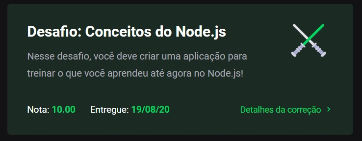

# Module 01 - NodeJS

This repository holds the content and exercises of Go Stack's first module: NodeJs.

## What was covered here?

NodeJS is a platform, build over Chrome's V8 that allows us to create and manage a backend using JavaScript. It's main characteristics are an Event-Loop + Call Stack architecture and Non-blocking I/O.

To see the full instructions of the challenge, you can click [here](./project-instructions.md).

#### Framework of choice

On this bootcamp, we'll use [Express](https://expressjs.com/) as our framework, due to it's simplicity to create a project and it's open structure.

If you are looking for other framework options, there's honorable mention to [AdonisJS](https://adonisjs.com/) and [NestJS](https://nestjs.com/)

#### Architecture of choice

Opposed to the 'traditional' full-MVC architecture, the bootcamp will be built using an API REST structure. Why?

Basically, because using REST we can:

1. Serve different types of clients (eg. mobile + web)
2. Have a protocol of communication with a pattern, using a data structure understood by every language: JSON.

#### HTTP concepts & Routes

Covers:

* Route
* Route Params
* Query Params
* Request Body/Header
* HTTP Codes (100-500s)

#### How to run this module's challenge

Make sure you have either npm or yarn installed.

1. clone this repository.
2. On the cloned directory, run either `yarn` or `npm install` to install dependencies
3. Run `yarn test` or `npm test` to see each test result
4. Run `yarn dev` or `npm dev` to start up the server on port 3333, allowing you to make HTTP requests to it.
5. You can use a software like [Insomnia](https://insomnia.rest/) to send your request and check each response.

* To create an entity, you should POST to /repositories with a JSON body containing the properties title, url and techs, which should be a string, string and an array of strings.

* To edit an entity, you should PUT to /repositories/:id, where id is the respective id generated once you create the entity. The PUT body should have the same JSON structure as the route to create it.

* To delete an entity, you should DELETE to /repositories/:id

* To increase the number of likes of an entity, you should POST to /repositories/:id/like

#### Grade on this module

This project got **10/10 100%** as per below:

###### Feedback

Any feedback regarding the structure of the code presented here is widely incentivized. Feel free to send me a PR too!
