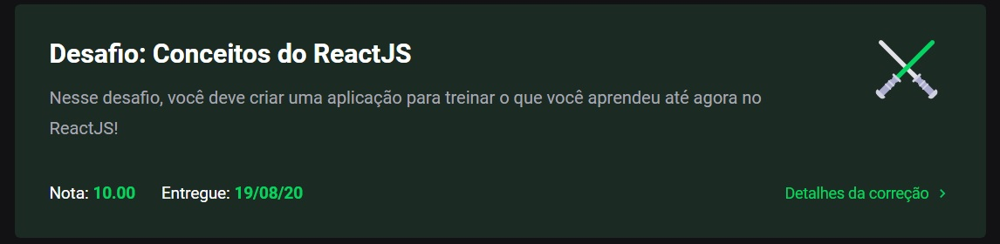

# Module 02 - ReactJS

This repository holds the content and exercises of Go Stack's second module: ReactJS.

## What was covered here?

React is a powerful library to create SPAs (single page applicatios) with re-usable 'HTML-like' components. And everything is done with a new syntax: JSX.

### Main concepts

* Components
* Properties
* State & Effect
* API integration

#### Context used

Here we did **not** use a boiler plate like `create-react-app` to build out first project, to understand what and when we use each feature.

Basically, to create a working project, we need two main things:

* Babel
* Webpack
* Loaders

While one converts (transpile) our code to a format the browser can understand (since not every ES implementation is added quickly to browsers), Webpack converts each file type (css, js, png...) and the loaders help it understand each type.

Because of that, babel.config.js and webpack.config.js are crucial parts of this build, and were both build from scratch.

#### How to run this module's challenge

Make sure you have either npm or yarn installed and you are running the server from module 01. [Link here](../Module_01_NodeJS).

1. clone this repository.
2. On the cloned directory, run either `yarn` or `npm install` to install dependencies
3. Run `yarn test` or `npm test` to see each test result
4. Run `yarn start` or `npm start` to start up the server. It should open a page in your web browser.

#### Grade on this module

This project got **10/10 100%** as per below:

###### Feedback

Any feedback regarding the structure of the code presented here is widely incentivized. Feel free to send me a PR too!
