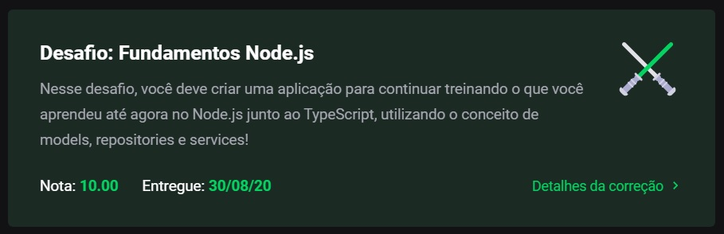

# Module 04 - Advanced Software Architecture w/ NodeJS

This repository holds the content and exercises of Go Stack's fourth module.

## What was covered here?

After learning the basics of creating a back-end server with NodeJS, this module's main goal is to introduce the best practices in creating a scalable back-end structure. On this matter, we start to apply SOLID & Separations of Concerns (SoC) methods in our back-end creation. If you want to see more examples of this being applied, check out how the back-end on the lecture was build [here](../Course_Lectures/nodeJS_designing_our_backend).

To sum up what's been covered, we saw:

* Creation of Models to better define how our data is created/treated.
* Use of *repositories* to connect our application to our data. Only these repositories are allowed to access/query the data.
* Use of single responsability *services* to perform an operation/apply logic on our route.

#### How to run this module's challenge

1. clone this repository.
2. On the cloned directory, run either `yarn` or `npm install` to install dependencies
3. Run `yarn test` or `npm test` to see each test result
4. If you'd like to test the server, execute `yarn dev:server` and make an HTTP Request to `localhost:3333/transactions`.
  1. To create a transaction, POST to this route using a JSON body in this format:
```typescript
reqBody = {
  title: string;
  value: number;
  type: 'outcome' | 'income';
}
```
  2. Then you can list your transaction history using a GET request.

#### Grade on this module

This project got **10/10 100%** as per below:



###### Feedback

Any feedback regarding the structure of the code presented here is widely incentivized. Feel free to send me a PR too!
