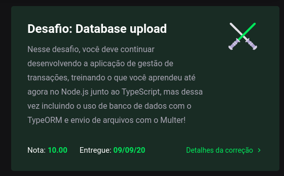

# Module 05 - DataBase interaction: real life NodeJS

This repository holds the content and exercises of Go Stack's fifth module.

## What was covered here?

After learning the basics of creating a back-end server with NodeJS and how to build it with SOLID principles, using Models, Services and Repositories, this module is focused on learning the real world NodeJS: using databases and a ORM to deal with it.

To sum up what's been covered, we saw:

* Creation of Models to better define how our data is created/treated.
* Use of *repositories* to connect our application to our data. Only these repositories are allowed to access/query the data.
* Use of single responsability *services* to perform an operation/apply logic on our route.
* File import: Receiving a CSV file and parsing it to add it's contents to the dataBase

Just like last module. The difference here is: we are now using a Postgres (SQL) database save each request we get.


#### How to run this module's challenge

1. clone this repository.
2. On the cloned directory, run either `yarn` or `npm install` to install dependencies
3. Run `yarn test` or `npm test` to see each test result
4. If you'd like to test the server, execute `yarn dev:server` and make an HTTP Request to `localhost:3333/transactions`.
  1. To create a transaction, POST to this route using a JSON body in this format:
```typescript
reqBody = {
  title: string;
  value: number;
  type: 'outcome' | 'income';
  category: string;
}
```
  2. Then you can list your transaction history using a GET request.
  3. To parse a CSV, send the file on a POST request to `/transactions/import` with a **multipart** key of 'file'. The csv should have the same headers as you would have on the request.body cited above.

#### Grade on this module

This project got **10/10 100%** as per below:



###### Feedback

Any feedback regarding the structure of the code presented here is widely incentivized. Feel free to send me a PR too!
