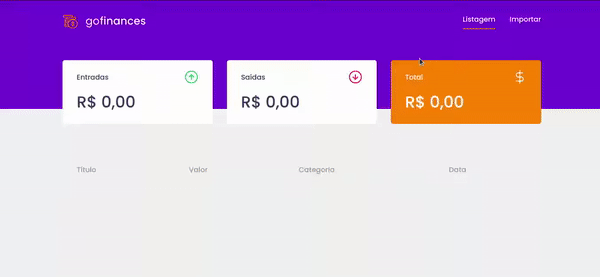
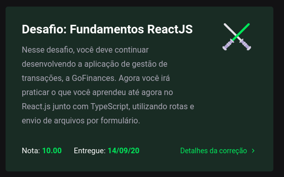

# Module 06 - Real Interfaces With React

This repository holds the content and exercises of Go Stack's sixth module.

## Challenge Overview

## What was covered here?

After setting up our backend server with a Postgres database using **Docker** ([done here](../Module_05_DataBase_NodeJS), it's time to create an interface to it! And to do that, we are going to use `create-react-app` to set up our boiler plate.

On that, we've seen:

* Routing with `react-router-dom` (building a SPA with the `Link` component)
* Creating unique styles for our elements using `styled-components`
* Using icons with `react-icons`
* Connecting to our API using `axios`
* Saving data on `localStorage`

#### How to run this module's challenge

*preparing*
1. make sure you have the [server](../Module_05_DataBase_NodeJS) from last module up and running properly if you want to check the complete interface out.

1. clone this repository.
2. On the cloned directory, run either `yarn` or `npm install` to install dependencies
3. Run `yarn test` or `npm test` to see each test result
4. If you'd like to check the interface out, run `yarn start`

#### Grade on this module

This project got **10/10 100%** as per below:

###### Feedback

Any feedback regarding the structure of the code presented here is widely incentivized. Feel free to send me a PR too!
