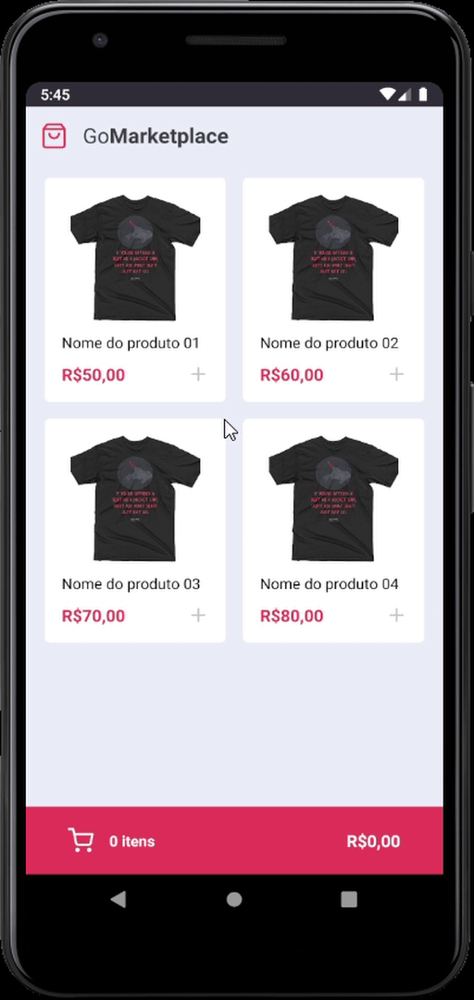
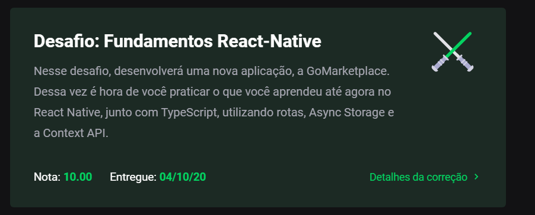

# Module 07 - Advanced React Native w/ Context

This repository holds the content and exercises of Go Stack's seventh module.

## Challenge Overview

## What was covered here?

After understanding advanced key concepts on React, such as navigation and context, it's time to see how they are done in a React Native app. On this challenge, we develop a two-screen marketplace-like application that connects to an API to get the available products and handles Cart additions though context.

#### How to run this module's challenge

*preparing*
1. make sure you have an emulator setup on your computer (it could be either android or iphone)

1. clone this repository.
2. On the cloned directory, run either `yarn` or `npm install` to install dependencies
3. Run `yarn test` or `npm test` to see each test result

- If you'd like to check the interface out:

1. Run, on a separate terminal window, `yarn json-server server.json -p 3333`. This simulates an API response
2. With your emulator opened, run either `yarn android` or `yarn ios`. This process might take a while (up to 10 minutes in some extreme cases). After it's done, it's likely that you`ll need to run the command again to start the script
3. If the `metro bundler` window did not open, simply run `yarn start` to do it.

#### Grade on this module

This project got **10/10 100%** as per below:

###### Feedback

Any feedback regarding the structure of the code presented here is widely incentivized. Feel free to send me a PR too!
