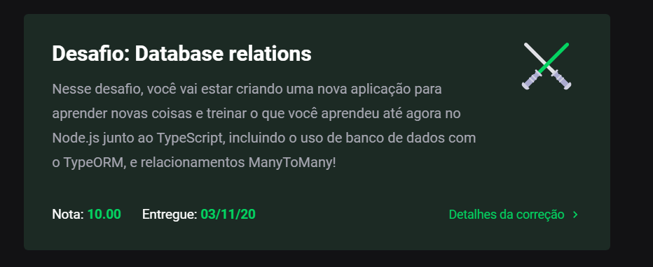

# Module 08 - Advanced Database Relations w/ NodeJS and TypeORM

This repository holds the content and exercises of Go Stack's eighth module.

## What was covered here?

After a more advanced round on ReactJS and ReactNative, it's time to come back to Databases and dig deeper into relations and the power of Typeorm to control said relations. On this challenge, a e-commerce like backend is to be developed, in which we can register clients, products and orders, which are made by a client and can have 1 or more different products on it.

Every detail about not ordering more than what we have on stock is also required.

To see the full instructions of the challenge, you can click [here](./project-instructions.md).

#### How to run this module's challenge

*preparing*
1. make sure you have a postgres image running on docker

1. clone this repository.
2. On the cloned directory, run either `yarn` or `npm install` to install dependencies
3. create a database called `gostack_desafio09_tests` (this is where the tests run)
4. Run `yarn test` or `npm test` to see each test result

- If you'd like to check the interactions:

1. Run `yarn dev:server` or `npm dev:server`
2. Open your preferred API Requesting APP. I'd recommend [Insomnia](https://insomnia.rest/)
3. You can make requests to `localhost:3333` on the following routes:

- `/customers`: accepts a POST request w/ name and email as JSON body
- `/products`: accepts a POST request w/ name, price and quantity as JSON body
- `/orders`: accepts a POST request w/ customer_id and products (an array of id and quantity) as JSON body
- `/orders/:id`: accepts a GET request w/ order_id as the route param

#### Grade on this module

This project got **10/10 100%** as per below:

###### Feedback

Any feedback regarding the structure of the code presented here is widely incentivized. Feel free to send me a PR too!
