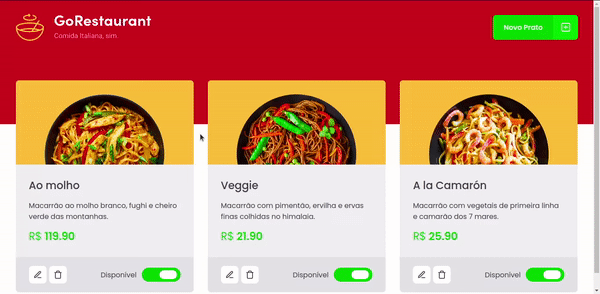

# Module 09 - Advanced CRUD w/ React

This repository holds the content and exercises of Go Stack's ninth module.

## Challenge Overview

## What was covered here?

To see the full instructions of the challenge, you can click [here](./project-instructions.md).

After understanding React as a whole, it's time to put everything to a more complex CRUD application testing.

This application ultimately is a web page for a restaurant.

#### How to run this module's challenge

1. clone this repository.
2. On the cloned directory, run either `yarn` or `npm install` to install dependencies
3. Run `yarn test` or `npm test` to see each test result

- If you'd like to check the interface out:

1. Run, on a separate terminal window, `yarn json-server server.json -p 3333`. This simulates an API response
2. Simply run `npm start` or `yarn start`

#### Grade on this module

This project got **10/10 100%** as per below:

###### Feedback

Any feedback regarding the structure of the code presented here is widely incentivized. Feel free to send me a PR too!
